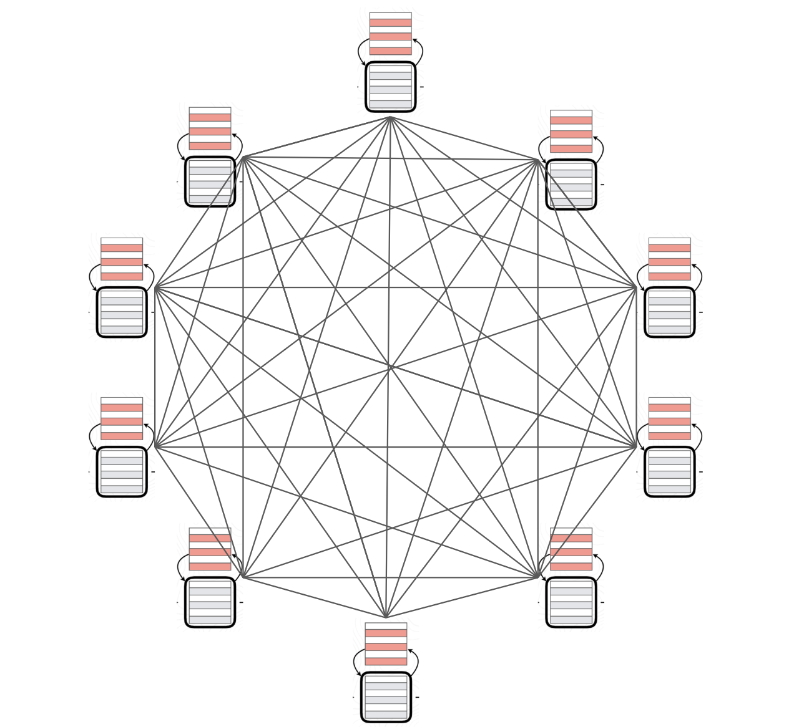

## BitTensor Network Daemon


> Decentralized Machine Intelligence

## Table of Contents

- [Overview](#overview)
- [To-Run-Locally](#to-run-locally)
- [To-Run-Testnet](#to-run-testnet)
- [Why](#why)
- [How](#how)
- [Market](#market)
- [Incentive](#incentive)
- [Organization](#organization)
  - [Nucleus](#nucleus)
  - [Dendrite](#dendrite)
  - [Synapse](#synapse)
  - [Metagraph](#metagraph)
- [Word-Embeddings](#word-embeddings)
- [License](#license)

---

## Overview

BitTensor allows a new class of Machine Learning models to train across a peer-to-peer network. It enables any computer and any engineer in the world to contribute in training.

The nature of trust-less computing necessitates that these contributions are combined through incentive rather than direct control from any one computer. We use a digital token to carry that incentive signal through the network: where the magnitude of this incentive is derived from a p2p collaborative filtering technique similar to Google's Page rank algorithm.  

The lack of centrality allows the structure to grow to arbitrary size across the internet. Both the cost and control of the system is distributed. And the network's informational product is priced into the reward token's value.

When run, this software folds your computing power into a p2p network and rewards you with an EOS based digital token for your contribution.

## To-Run-Locally
1. [Install Docker](https://docs.docker.com/install/)

```
$ git clone https://github.com/unconst/BitTensor
$ cd BitTensor

# Run a test EOS blockchain.
$ ./start_eos.sh

# Run Node 1.
$ ./bittensor.sh

# Run Node 2.
$ ./bittensor.sh

...

# Run Node N.
$ ./bittensor.sh

```

## To-Run-Testnet

1. [Install Docker](https://docs.docker.com/install/)
1. [Make account on Digital Ocean](https://www.digitalocean.com/)
1. [Make a Digital Ocean API key](https://cloud.digitalocean.com/account/api/tokens)

```
$ git clone https://github.com/unconst/BitTensor
$ cd BitTensor

# Run a Remote Node
$ ./bittensor.sh --remote --token $DIGITAL_OCEAN_TOKEN --eosurl http://142.93.177.245:8888


# Run a Local Node
$ python src/upncp.py --port 9091  // To punch a hole in your router.
$ ./bittensor.sh --port 9091 --eosurl http://142.93.177.245:8888

```


## Why

We believe Machine Intelligence, like Human Intelligence, is an a priori good. And yet, intelligence is power and power, if held in the hands of the few, will corrupt. Machine Intelligence should be democratized and made open source. Unfortunately, companies like OpenAI who claim this goal have failed in their mandate, opening up the algorithms but not access to the _intelligence_ itself.

This technology is being built to do this, while democratizing its ownership, and sharing its profit with any computer or any individual who deems it worthwhile to contribute.

Moreover, although democratization and openness are ethical values, we are relying on their practical use here: A free and open system with a large number of stake holders is also the most direct path towards our goal of producing Strong Machine Intelligence. The scale of the AI problem in front of us necessitates that we build it this way.

Why is this? Because decentralized computing approaches can harness the largest pool of computing power and the largest pool of collaborators: Every computer and every engineer can contribute to this system. We've seen how this worked for Bitcoin, the largest super computer in the world, BitTorrent, at one time, the largest bandwidth user across the globe, and open source Linux, the most widely used operating system in use today.


Above: Bitcoin Lightning network nodes from late 2018.

## Introduction

In standard Machine learning setting, the training mechanism uses Back-propagation to minimize the loss on a dataset with respect to the weights, and at each step the model parameters wait for a signal from the global loss function before the next update.

This loss function centrality is prohibitive when the scale of those networks reach the scale desired by modern machine learning  -- or biological scale -- and necessarily so, when we are attempting to train a system which spans multiple computers connected across the web, as we are doing here.

To avoid this problem, each node within the p2p network is training against its unique 'local' loss function. Each participant  has it own dataset and it hypothetically working on problems which are disjoint. They do not wait for a global error signal to propagate backwards from a far off computer's loss. The local models can be split width-wise in each node, across compute hardware with rapid communication, while the local losses allow depth-wise, lateral, expansion of the network.


Above: Local loss function training in a k-graph shaped NN organization.

## Training Method

To begin we follow a standard training scheme within each component.  Node i, contains a dataset M, with targets X_i and labels Y_i, and is attempting to fit a function that predicts the output from the input, yˆ = f_i(x), by minimizing the loss on the output of the model,

  L_i(ˆy, y) = Ep[ -logQ(f_i(x), x)]. (1)

Where Q is the cross entropy between targets and outputs and Ep is the expectation over a subset P of our dataset M, our training set. The model is also a composition of its neighboring models f_i = (f 1 ◦ f 2 ... f n ), and is optimizing its own model parameters θ by moving them in the direction of the gradient of its loss, namely ∂ θ i L_i(ˆy, y). 

Simultaneously f_i may be the upstream composition for another component k, where k is training its own local function f_k = ( f_i, ... ) where the output of our model is the input to that model, and we are recieving streams of gradient information from f_k which carry information to update f_i's parameters θ by moving them in the direction of the gradient of this remote loss, ∂ θ i L_k(ˆy, y). 

We combine the stream of gradients from these losses using a in-feed queue which is last-in first-out cyclic -- each component is pulling gradient updates greedily from it in an online fashion to update its model. This extends of our local loss with those of our parents. L_total = [ L_i, L_k1, ... Lkn] for n parent problems.

## P2P Training.

We are extending previous work in local loss function training by moving the training process from a datacenter into a decentralized computing domain: No computer is privileged, there is no single user of the network, and some computers may be incompetent, offline, or malicious. In lieu of these constraints we must use _incentive_ to draw our compute nodes into line.  We want them to stay online, and to learn well, and to train in alignment with a useful network product.

We begin by defining our network problem. The global objective for the entire network, *L* is a summation over each local objective *L* = Σ Li.  Our goal is to incent each component towards optimizing this global loss function. i.e. towards minimizing *L*.

To do this, we first augment our global loss with a stake vector *S*, e.g. *L* = *S* ◦ *L* such that the global loss function is scaled towards computers holding stake. Stake quantities are stored in the form of a digital token on a decentralized compute and storage network known as a blockchain. These tokens can be transferred and sold and they immediately hold value within the network --  holding more stake directly changes the network's global loss.

## Local Ranking.

In order to drive nodes towards optimizing the global loss we wish to incent components to minimize the global loss. This statement is equivalent to asking what it would cost, in terms of loss, to prune a single component, f_k, from the network.

Pruning a single component is equivalent to a change in parameters d, and with respect to our loss, L, we can approximate the corresponding change with a 2nd order approximation around the current parameter values θ:

  g = ∇L(θ), H = ∇2L(θ), (3)
  L(θ + d) − L(θ) ≈ g T d + 0.5 d H d (4)

Where g is the gradient of the loss and H is the Hessian. Following this approximation, dropping the kth parameter (setting θk = 0) would lead to the following increase in loss:

  L(θ − θkek) − L(θ) ≈ − gkθk + 0.5 * Hkkθ^2k (5)

where ek is the unit vector which is zero everywhere except at its kth entry, where it is 1. Following related methods which also start from a 2nd order approximation, we assume that the current set of parameters is at a local optimum and that the 1st term vanishes as we average over a dataset of inputs. For the diagonal of the Hessian, we use the approximation:

  Hkk ≈ EP [∂ / ∂θk log Qθ(fi(x) | x)^2] (6)

Assuming that Qθ(fi(x) | x) is close to M(fi(x)|x), Eqn. (6) can be viewed as an empirical estimate of the Fisher information of θk, where an expectation over the model is replaced with real data samples. If Q and M are in fact equal and the model is twice differentiable with respect to parameters θ, the Hessian reduces to the Fisher information matrix and the approximation becomes exact. If we use N data points to estimate the Fisher information, our approximation of the increase in loss becomes

  ∆k = 1/2N θk Σgnk^2, (7)

where gn is the gradient of the parameters with respect to the nth data point.

## Composition Ranking.

For our compositional architecture, we wish to understand this pruning signal with respect to the inputs from neighboring components instead of individual parameters. Let ankij be the input of the kth component, f_k, at activation location j for the nth datapoint to the ith loss. Let us also introduce a binary mask m ∈ {0, 1} K into the network which modifies the activations ankij of each feature map k as follows:

  ankij' = mk * ankjij . (8)

m is full mask of the kth input component to our function f_i = (f_0 ◦ f_1 ... f_k ... f_n). The gradient of the loss for the nth datapoint with respect to mk is,

gnk = −\sum_{i=0} ankij ∂/∂ankij log Q(f(x) | x) (9)

and the pruning signal between the ith component and teh jth component is, Aij = 1/2N \sum_{i=0} gnk^2. The gradient with respect to the activations is available during the backward pass of computing the network’s gradient and the pruning signal can therefore be computed at little extra computational cost.

## Global Attribution

It would be sufficient at this point to sum each local attribution across each component and depth one score for each node. However, we are interested in the attribution scores for every pair-wise path through the graph -- each component has multiple children who have multiple children and we wish to know their contributions as well.

This follows immediately from the  notion of transitive value: If a component i values component j, it should also value the components trusted by j since component j is a composition of its neighbors.

We have each component i calculate the local weight importance Aij for all its neighbors (sub components).
posting them to a centralized contract running on a decentralized append only database (blockchain). This contract stores normalized weights as a directed weighted graph G = [V, E] where for each edge _eij_ in E we have a value _wij_ associated with the connection between component _fi_ and _fj_. G is updated continuously by transaction calls from each working component as they train and as they calculate attribution scores for their neighbors in the network.

From this graph, G, global attribution scores for component _fi_ are calculated using a modified EigenTrust algorithm which iteratively updates the component use vector to an attractor point through multiple multiplications by the adjacency matrix described by G. i.e. a(t+1) = G * a(t).

## Emission System

Normalized global attribution is used to determine the total of new currency emitted within the graph per component, with high contributors attaining a high score. The entire calculation is done using a consensus engine which ensures that the specifics of token emission stay fixed. The state of G is held global so that every node can see how they are attaining token emissions.

below is an approximate method written below using python-numpy:
```
def attribution_simulation():

    # Stake vector.
    S = [9.  8.  7.  6.  5.  4.  3.  2.  1.  0.]

    # Loop-in edges.
    N = [0.6 0.9 0.4 0.5 0.5 0.5  1.  1.  1.  1. ]

    # Outgoing edges.
    M =[[0.  0.1 0.3 0.2 0.  0.  0.  0.  0.  0. ]
        [0.1 0.  0.  0.1 0.  0.  0.  0.  0.  0. ]
        [0.1 0.  0.  0.2 0.  0.  0.  0.  0.  0. ]
        [0.2 0.  0.3 0.  0.  0.  0.  0.  0.  0. ]
        [0.  0.  0.  0.  0.  0.5 0.  0.  0.  0. ]
        [0.  0.  0.  0.  0.5 0.  0.  0.  0.  0. ]
        [0.  0.  0.  0.  0.  0.  0.  0.  0.  0. ]
        [0.  0.  0.  0.  0.  0.  0.  0.  0.  0. ]
        [0.  0.  0.  0.  0.  0.  0.  0.  0.  0. ]
        [0.  0.  0.  0.  0.  0.  0.  0.  0.  0. ]]

    # Loop over blocks.
    n_blocks = 100
    for _ in range(n_blocks):        

        # Attribution calculation.
        depth = 100
        A = np.multiply(S, N)
        T = np.matmul(M, S)
        for _ in range(depth):
            A += np.multiply(T, N)
            T = np.matmul(M, T)

        # Emission calculation.
        tokens_per_block = 50
        A = A / np.linalg.norm(A, 1)
        E = A * tokens_per_block
        S = S + E
```


## Organization


Above: An Engineering diagram of the brain. For inspiration.

```

                                     [EOS]
                                       |
                                  [Metagraph]
                               /       |       \
                    ----------------------------------------
                  |                  Neuron                  |
                  |                                          |
                  | [Dendrite] ---> [Nucleus] ---> [Synapse] |
                  |                                          |
                  |                                          |
                    ----------------------------------------
                               \       |       /
                                     [Main]
```


###### Nucleus
The main Tensorflow graph is defined and trained within the Nucleus object. As is, the class is training a self supervised word-embedding over a dummy corpus of sentences in text8.zip. The result is a mapping which takes word to a 128 dimension vector, representing that word while maintaining its semantic properties.

Although subject to future change, this problem serves as a good starting place because its generality and ubiquity within Artificial intelligence. In future versions of this code, this will be expanded to include sentence and paragraph embeddings, speech, image and video embeddings with the goal of training the network for general multitask.

###### Dendrite
During training the Nucleus interacts with the rest of the network through its Dendrite. The Dendrite maintains connections to upstream nodes making asynchronous calls using GRPC, and passing serialized Tensor protocol buffers along the wire.

During validation and inference the Dendrite is cut from the model and replaced by submodules which have been trained through distillation to approximate the incoming signals from the rest of the network.

###### Synapse
This inference graphs being produced in training are served by the Synapse object. The Synapse is responsible for upstream connections. It is responsible for rate limiting, and through this,  negotiating for higher attribution within the Metagraph.

Since the Synapse object is merely serving the inference graph, it is mostly detached from the Nucleus and Dendrite during training, only communicating with these objects by pulling the latest and best inference graph from the storage directory.

###### Metagraph
The Metagraph object acts as an interface between the EOS blockchain and the rest of the neuron. Through the Metagraph, this node can post updated attributions and call timed token emission (which releases newly mined tokens) The Metagraph object also serves as a de-facto DHT which removes the need for a gossip protocol used by many standard p2p applications Bitcoin and BitTorrent not withstanding.

###### EOS
The EOS contract is separate from Dendrite. Nucleus, Synapse and Metagraph objects during execution. During testing, this class is run on a local EOS instance, but during production the contract is running in a decentralized manner across the EOS network.  


---

## Word-Embeddings

A word-embedding is a projection from a word to a continuous vector space representation of that word, which attempts to maintain the semantics under the projection, For instance, 'King' --> [0,1, 0,9, ..., -1.2], such that 'King' - 'Queen' = 'Male'.

Word-embeddings are highly useful initital projections for a large number of Machine Learning problems. This makes them an ideal product for our network. They can also be trained in an un-supervised fashion which is a requirment for the local-loss approach described above.

During training we use a language corpus and find our projection by training a classifier to predict words in context. For example, the sentence 'The queen had long hair', may produce a number of supervised training examples ('queen' -> 'had'), or ('hair' -> 'long'). The ability to predict context requires an understanding of the relationships between words ('meaning' is a relational quality) -- a highly successful assumption in practice.

In the prototype node above, we train each NN using a standard skip gram model, to predict the following word from the previous, however any other embedding producing method is possible -- indeed, the goal should be diversity.

## License

MIT
