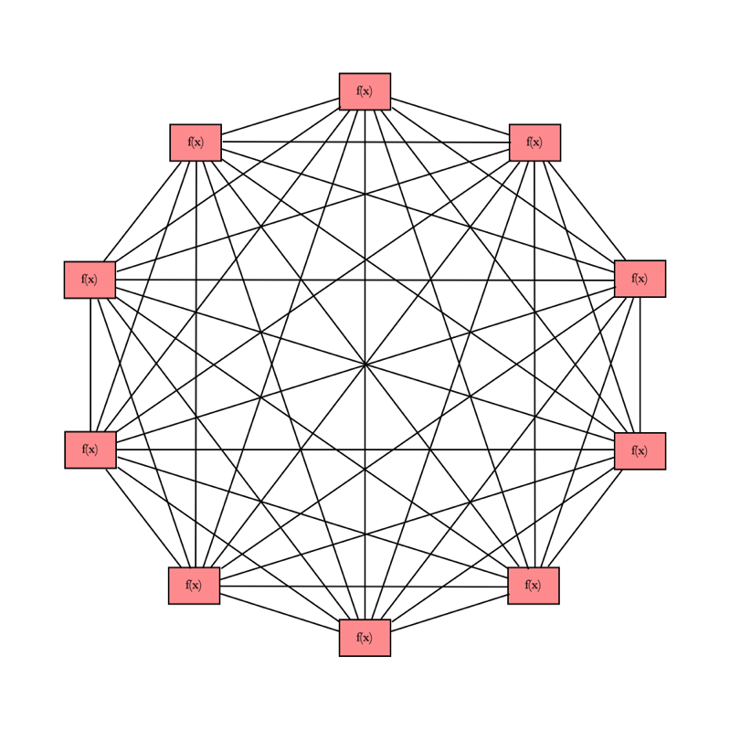
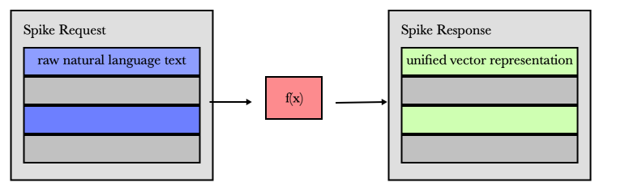

## BitTensor Network Daemon


## Table of Contents

- [Overview](#overview)
- [To-Run-Locally](#to-run-locally)
- [To-Run-Testnet](#to-run-testnet)
- [Introduction](#introduction)
- [Method](#method)
  - [Components](#components)
  - [Representation](#representation)
  - [Incentive](#incentive)
  - [Attribution](#attribution)
  - [Emission](#emission)
- [BitTensor1](#bitTensor1)
  - [Nucleus](#nucleus)
  - [Dendrite](#dendrite)
  - [Synapse](#synapse)
  - [Metagraph](#metagraph)
- [References](#references)
- [License](#license)

---

## Overview

BitTensor allows a new class of Machine Learning model which trains across a peer-to-peer network. It enables any computer and any engineer in the world to contribute to its training.

The nature of trust-less computing necessitates that these contributions are driven by incentives rather than by direct control from any one computer. We use a digital token to carry that incentive signal through the network: Where the magnitude of this incentive is derived from a p2p collaborative filtering technique similar to Google's Page rank algorithm.  

As a network product we focus on learning unsupervised multi-task representations, starting from language and extending the network to image and speech. The result is a sufficiently general product which is useful to a large number of downstream stake holders.

The lack of centrality allows the structure to grow to arbitrary size across the internet. Both the cost and control of the system is distributed and the network's informational product is priced into the reward token's value.

When run, this software folds your computing power into a p2p network and rewards you with an EOS-based digital token for your contribution.

## To-Run-Locally
1. [Install Docker](https://docs.docker.com/install/)

```
$ git clone https://github.com/unconst/BitTensor
$ cd BitTensor

# Run a test EOS blockchain.
$ ./start_eos.sh

# Run Node 1.
$ ./bittensor.sh

# Run Node 2.
$ ./bittensor.sh

...

# Run Node N.
$ ./bittensor.sh

```

## To-Run-Testnet

1. [Install Docker](https://docs.docker.com/install/)
1. [Make account on Digital Ocean](https://www.digitalocean.com/)
1. [Make a Digital Ocean API key](https://cloud.digitalocean.com/account/api/tokens)

```
$ git clone https://github.com/unconst/BitTensor
$ cd BitTensor

# Run a Remote Node
$ ./bittensor.sh --remote --token $DIGITAL_OCEAN_TOKEN --eosurl http://142.93.177.245:8888


# Run a Local Node
$ python src/upncp.py --port 9091  // To punch a hole in your router.
$ ./bittensor.sh --port 9091 --eosurl http://142.93.177.245:8888

```


## Introduction

Today, Machine Intelligence is driven by incremental improvements on datasets by best-in-class systems owned almost exclusively by the large technological institutions that have access to the needed computing power. While the system has worked well to push the boundaries of almost every aspect of Machine Intelligence, we are still very far from achieving the ultimate goal of strong machine intelligence.

For one thing, work done training the latest best-in-class models is thrown out with every new algorithmic improvement. Though there is some use of distillation, there is little transfer of intelligence between new generations of models. The size of the largest Neural Network architectures is still many magnitudes smaller than a single human brain, and consume much more energy.

Moreover, the ownership and profits of Machine Intelligence are in the hands of a few large corporations who have the computing power and the talent to beat out competitor systems. Companies like OpenAI who have claimed the goal of opening access have failed in their mandate, opening up the algorithms but not the intelligence itself.

What is needed is a collaborative machine-learning system based on incentives. This will drive advancement via a market rather than, say, through academic accreditation. The ownership, access, and profits from the system should be decentralized. When this occurs, the network will grow naturally in proportion to its value.

In addition, it should accumulate learning, not be discarding work that it has generated in the past. Driven by incentives, this type of network will be able to harness a much larger pool of computing power and  collaborators. In essense, because any computer or any interested party will be able to contribute, this will allow the structure to grow to an arbitrary size across the internet


Above: Bitcoin Lightning network nodes from late 2018.

## Method

### Components

We define each component in our network as a Machine Intelligence function which operates on tensors. It can be queried with a tensor of defined shape and type and will return a tensor which is the output of that operation on its input. It may also be networked, and is composing its operation with downstream components in the network f(x) = (d1 ◦ d2 ... dn ) and, in reflection, serving its own model to upstream components, u1, u2 ... un = ( ... f(x), ... ) where the output of our model is an input to those models.

<p align="center">

</p>

Each node is differential, it accepts gradient information from upstream components (u1, u2 ... un) and sends gradient information downstream, to components (d1 ◦ d2 ... dn ). The gradients carry information on how to update remote parameters θ by moving them in the direction of some loss function -- intuitively, no different from a neuron in a standard differential graph architecture. A network of these components could span multiple computers across the web and form a peer-to-peer version of a Neural Network.

<p align="center">

</p>

One problem with the above system would be latency and infinite-recursion. Specifically, message passing between consecutive nodes may involve long jump distances on the wide-internet and an ad-hoc structure guarantees no protection against graph cycles. Our solution is to suggest distillation [16] where each component extracts knowledge from downstream models by training a proxy network to learn the outputs from their inputs. With distillation, each call to a neighboring component only involves a single hop, and standalone inference models can be extracted from the network at any point.

### Representation

In our collaborative domain, we require a Machine Intelligence problem which is general enough to interest a diverse set of stake holders. Moreover, the problem should be sufficiently difficult to warrant such a global system and the data used to train it should be ubiquitous and cheap.

For our purposes, we choose unsupervised representation learning [5,6,7,9,10,14,24,25], where components train themselves on large-scale unlabeled corpora to learn a basis ('representation') for downstream tasks. Knowledge attained learning in this way is general and transferrable, and has been highly successful improving performance across a wide spectrum of tasks.

Within this modality, we initially focus on Language Representation from text in the most general sense. Each components is learning to understand raw language and will respond to queries in pure unicode strings with semantic representations. We leave tokenization and parsing to each component and outputs across the network are fixed length vectors.

<p align="center"> "raw natural language text" ---> [f(x)] ---> [fixed length representation] </p>

<p align="center">

</p>

Starting initially with word embedding methods [24] and then to more sophisticated contextual word-embeddings [25] and large text inputs [6], this shared high-level paradigm has seen a range of training methods developed.

For instance, BERT [5] which used multi-word masking strategies. MT-DNN [14] which combined pre-training with multi-task knowledge transfer. GPT-2 [7] which added task information from an independently sourced question-answering dataset. XLM which used language embeddings to improve performance for cross-lingual tasks. ERNIE [10] which added entity/phrase level masking and XLNet[9] which implemented learning across all mask permutations.

The unlabeled datasets used to train them have been equally diverse, ranging from hundreds of freely available datasets, translation corpuses, reddit crawls, wikipedia entries and books. This reflects the ubiquity and inexpensive nature of unlabeled natural language. There is no need to worry about protecting datasets.

### Incentive

We are extending previous work in Neural Network training by moving the training process from a datacenter into a decentralized computing domain where no computer is privileged, there is no single user of the network, and some computers may be incompetent, offline, or malicious. In lieu of these constraints we must use _incentive_ to draw our compute nodes into line. That incentive should drive them to stay online, to learn well, and train in alignment with a useful network product.

To begin, we assume a standard training scheme within each p2p component. They may contain a language dataset M, with targets X and self-supervised labels Y, and be attempting to fit a function that predicts the output from the input, yˆ = f(x), by minimizing the loss on the output of the model,

  <p align="center"> Loss = Ep[L(f(x), x)]. (1) </p>

Where L is a loss calculation between the targets and outputs, (for instance cross-entropy), and Ep is the expectation over a training subset P of our full dataset M. The global objective for the entire network, L is a summation over each local objective L = Σ Li. Our goal should be to incent each component towards optimizing this global loss function. i.e. towards minimizing L.

To do this, we first scale our global loss with a stake vector S, namely, L = S ◦ L such that the global loss function is scaled towards computers holding stake. This binds the concept of value into the network training process -- attaching more stake towards a loss function directly changes the objective function.

Stake quantities are represented in the form of a digital token using a decentralized compute and storage network known as a blockchain. The tokens can be transferred and bought by computers who wish to attain more power over the network. For instance, to fine tune a translation or sentiment analysis problem deriving its performance from an understanding of language.

### Attribution
We wish to mint new tokens to components in-proportion to their contribution optimizing the global loss.
Following methods used to prune neural networks[17][18], asking how much a components contributes is equivalent to asking what it would cost, in terms of loss, to prune that from the network.

<p align="center"> ∆Lj = the change in global loss w.r.t removal of single component j. </p>

We begin with the local estimation, ∆Lij, with respect to a single loss Li, and a connected component j. We can calculate ∆Lij using a 2nd order approximation of the loss with respect to its input activations aj, and a change ∆aj reflecting the removal of the component j.

<p align="center"> ∆Lij = L(aj + ∆aj) − L(aj) ≈ g' ∙ ∆aj  +  1/2 ∆aj ∙ H ∙ ∆aj (4) </p>

Where g is the gradient of the loss which vanishes if we assume the loss is at a local optimum. The remaining term is the Hessian and can be approximated using the following expectation over our training subset P:

<p align="center"> H ≈ Ep [ ( ∂L(x)/∂aj ) ^2] (6)</p>

This approximation becomes exact when P and M are close and Eqn. (6) can be viewed as an empirical estimate of the Fisher information of our activations. We can use N data points to estimate our pruning signal *∆Lij*.

<p align="center"> gn = ( ∂L(xn)/∂aj )^2. </p>
<p align="center"> ∆Lij = 1/2N   ∆aj   Σn gn^2 (7)</p>

This information is available during the backward pass of computing the network’s gradient and the pruning signal can therefore be found at little extra computational cost.

### Emission

The totality of ∆Lij scores describe a directed weighted graph G = [V, E] where for each edge eij in E we have a the weight *∆Lij* associated with the connection between component i and j. ∆Lij is a local attribution and we would like to determine the global attribution for a node i, ∆Li. This score should be a sum over every pair-wise path through the graph weighted by stake *Si*.

<p align="center"> ∆Lj = Σi Si x ∆Lij </p>

We can derive all pair-wise paths by applying the chain rule to (7) to find the following recursive relation:

<p align="center"> Given ∆Lij and ∆Ljk </p>
<p align="center"> ∆Lik = ∆Lij x ∆Ljk (8) </p>

Which is intuitive, following immediately from the notion of transitive contribution: If a component i contributes to component j, it should multiplicatively contribute to the components using j since they are compositions of its parent.

As a corollary of (8) global attribution scores for component _i_ can be calculated with a Power Iteration over adjacency matrix described by G.

<p align="center">  ∆L(t+1) = G ∙ ∆L (t). (9) </p>

This is similar to the EigenTrust algorithm [23] or Google Page Rank [1], but with Fishers Information scores instead of recommendations or web links. We emit new tokens within the graph to components with high contribution scores proportionally. The entire calculation is done using a consensus engine which ensures that the specifics of token emission stay fixed and where the state of G is held global so that every node can see how they are attaining token emissions.

We note that this form of local attribution emission scheme may be similar in nature to the propagation of the neurotrophic factor BDNF in the brain.[2]

below is an approximate method written below using python-numpy:
```
N_BLOCKS = 100
DEPTH = 100
TOKENS_PER_BLOCK = 50

def get∆L ():
  ∆L = np.multiply (S, Lii)
  T = np.matmul (Lij, S)
  for _ in range(DEPTH):
      ∆L += np.multiply(T, Lii)
      T = np.matmul (Lij, T)

  ∆L = ∆L / np.linalg.norm(∆L, 1)
  return ∆L

def emit():
  # Stake vector.
  S = [9.  8.  7.  6.  5.  4.  3.  2.  1.  0.]

  # i to i attributions
  Lii = [0.6 0.9 0.4 0.5 0.5 0.5  1.  1.  1.  1. ]

  # i to j attributions
  Lij =[[0.  0.1 0.3 0.2 0.  0.  0.  0.  0.  0. ]
    [0.1 0.  0.  0.1 0.  0.  0.  0.  0.  0. ]
    [0.1 0.  0.  0.2 0.  0.  0.  0.  0.  0. ]
    [0.2 0.  0.3 0.  0.  0.  0.  0.  0.  0. ]
    [0.  0.  0.  0.  0.  0.5 0.  0.  0.  0. ]
    [0.  0.  0.  0.  0.5 0.  0.  0.  0.  0. ]
    [0.  0.  0.  0.  0.  0.  0.  0.  0.  0. ]
    [0.  0.  0.  0.  0.  0.  0.  0.  0.  0. ]
    [0.  0.  0.  0.  0.  0.  0.  0.  0.  0. ]
    [0.  0.  0.  0.  0.  0.  0.  0.  0.  0. ]]

  # Loop over blocks.
  for _ in range(N_BLOCKS):        
    ∆L = get∆L()               // Modified EigenTrust
    E = ∆L * TOKENS_PER_BLOCK             // Emission this block
    S = S + E                             // Stake update.
```

----


## BitTensor1.


Above: An Engineering diagram of the brain. For inspiration.

```

                                     [EOS]
                                       |
                                  [Metagraph]
                               /       |       \
                    ----------------------------------------
                  |                  Neuron                  |
                  |                                          |
                  | [Dendrite] ---> [Nucleus] ---> [Synapse] |
                  |                                          |
                  |                                          |
                    ----------------------------------------
                               \       |       /
                                     [Main]
```


###### Nucleus
The main Tensorflow graph is defined and trained within the Nucleus object. As is, the class is training a self supervised word-embedding over a dummy corpus of sentences in text8.zip. The result is a mapping which takes word to a 128 dimension vector, representing that word while maintaining its semantic properties.

Although subject to future change, this problem serves as a good starting place because its generality and ubiquity within Artificial intelligence. In future versions of this code, this will be expanded to include sentence and paragraph embeddings, speech, image and video embeddings with the goal of training the network for general multitask.

###### Dendrite
During training the Nucleus interacts with the rest of the network through its Dendrite. The Dendrite maintains connections to upstream nodes making asynchronous calls using GRPC, and passing serialized Tensor protocol buffers along the wire.

During validation and inference the Dendrite is cut from the model and replaced by submodules which have been trained through distillation to approximate the incoming signals from the rest of the network.

###### Synapse
This inference graphs being produced in training are served by the Synapse object. The Synapse is responsible for upstream connections. It is responsible for rate limiting, and through this,  negotiating for higher attribution within the Metagraph.

Since the Synapse object is merely serving the inference graph, it is mostly detached from the Nucleus and Dendrite during training, only communicating with these objects by pulling the latest and best inference graph from the storage directory.

###### Metagraph
The Metagraph object acts as an interface between the EOS blockchain and the rest of the neuron. Through the Metagraph, this node can post updated attributions and call timed token emission (which releases newly mined tokens) The Metagraph object also serves as a de-facto DHT which removes the need for a gossip protocol used by many standard p2p applications Bitcoin and BitTorrent not withstanding.

###### EOS
The EOS contract is separate from Dendrite. Nucleus, Synapse and Metagraph objects during execution. During testing, this class is run on a local EOS instance, but during production the contract is running in a decentralized manner across the EOS network.  


## References

[1] The PageRank Citation Ranking <br/>
http://ilpubs.stanford.edu:8090/422/1/1999-66.pdf

[2] Brain-derived neurotrophic factor and its clinical implications <br/>
https://www.ncbi.nlm.nih.gov/pmc/articles/PMC4697050/

[3] Attention is all you need <br/>
https://arxiv.org/abs/1706.03762

[4] Universal Language Model Fine-Tuning for Text Classification <br/>
https://arxiv.org/abs/1801.06146

[5] Bi-directional Encoder Representations from Transformers <br/>
https://arxiv.org/abs/1810.04805

[6] Googles Transformer-XL <br/>
https://arxiv.org/abs/1901.02860

[7] Open AI GPT2 <br/>
https://openai.com/blog/better-language-models/

[9] XLNet <br/>
https://arxiv.org/abs/1906.08237

[10] ERNIE: Enhanced Representation through Knowledge Integration <br/>
https://arxiv.org/abs/1904.09223

[11] RoBerta: A Robustly Optimized Bert Pre-training Approach <br/>
https://arxiv.org/abs/1907.11692

[12] Cross-lingual Language Model Pre-training <br/>
https://arxiv.org/pdf/1901.07291.pdf

[13] Outrageously Large Neural Networks: The Sparsely-Gated Mixture-of-Experts Layer<br/>
https://arxiv.org/abs/1701.06538

[14] One Model To Learn Them All<br/>
https://arxiv.org/abs/1706.05137

[15] AHaH Computing–From Metastable Switches to Attractors to Machine Learning<br/>
https://journals.plos.org/plosone/article?id=10.1371/journal.pone.0085175

[16] Distilling the Knowledge in a Neural Network <br/>
https://www.cs.toronto.edu/~hinton/absps/distillation.pdf

[17] Faster Gaze Prediction With Dense Networks and Fisher Pruning <br/>
https://arxiv.org/pdf/1801.05787.pdf

[18] Overcoming catastrophic forgetting in neural networks <br/>
https://arxiv.org/abs/1612.00796

[19] Bitcoin: A Peer-to-Peer Electronic Cash System <br/>
https://bitcoin.org/bitcoin.pdf

[20] IPFS - Content Addressed, Versioned, P2P File System <br/>
https://arxiv.org/abs/1407.3561

[21] Self-Attention with Relative Position Representations <br/>
https://arxiv.org/pdf/1803.02155.pdf

[22] Generating Wikipedia by Summarizing long sequences <br/>
https://arxiv.org/pdf/1801.10198.pdf

[23] The EigenTrust Algorithm for Reputation Management in P2P Networks <br/>
http://ilpubs.stanford.edu:8090/562/1/2002-56.pdf

[24] Distributed Representations of Words and Phrases and their Compositionality <br/>
https://arxiv.org/pdf/1310.4546.pdf

[25] Skip-Thought Vectors <br/>
https://arxiv.org/abs/1506.06726

## License

MIT
