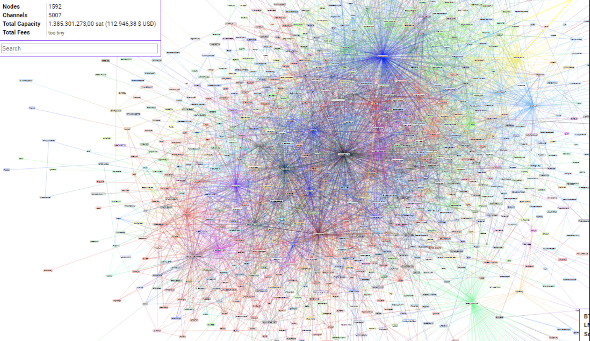
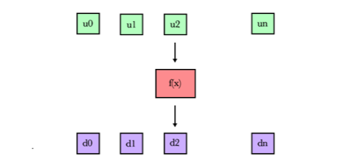

## BitTensor Network Daemon


> Decentralized Machine Intelligence

## Table of Contents

- [Overview](#overview)
- [To-Run-Locally](#to-run-locally)
- [To-Run-Testnet](#to-run-testnet)
- [Introduction](#introduction)
- [Method](#method)
- [Incentive](#incentive)
- [Attribution](#attribution)
- [Emission](#emission)
- [Organization](#organization)
  - [Nucleus](#nucleus)
  - [Dendrite](#dendrite)
  - [Synapse](#synapse)
  - [Metagraph](#metagraph)
- [Word-Embeddings](#word-embeddings)
- [References](#references)
- [License](#license)

---

## Overview

BitTensor allows a new class of Machine Learning model which trains across a peer-to-peer network. It enables any computer and any engineer in the world to contribute in training.

The nature of trust-less computing necessitates that these contributions are combined through incentive rather than direct control from any one computer. We use a digital token to carry that incentive signal through the network: where the magnitude of this incentive is derived from a p2p collaborative filtering technique similar to Google's Page rank algorithm.  

The lack of centrality allows the structure to grow to arbitrary size across the internet. Both the cost and control of the system is distributed. And the network's informational product is priced into the reward token's value.

When run, this software folds your computing power into a p2p network and rewards you with an EOS based digital token for your contribution.

## To-Run-Locally
1. [Install Docker](https://docs.docker.com/install/)

```
$ git clone https://github.com/unconst/BitTensor
$ cd BitTensor

# Run a test EOS blockchain.
$ ./start_eos.sh

# Run Node 1.
$ ./bittensor.sh

# Run Node 2.
$ ./bittensor.sh

...

# Run Node N.
$ ./bittensor.sh

```

## To-Run-Testnet

1. [Install Docker](https://docs.docker.com/install/)
1. [Make account on Digital Ocean](https://www.digitalocean.com/)
1. [Make a Digital Ocean API key](https://cloud.digitalocean.com/account/api/tokens)

```
$ git clone https://github.com/unconst/BitTensor
$ cd BitTensor

# Run a Remote Node
$ ./bittensor.sh --remote --token $DIGITAL_OCEAN_TOKEN --eosurl http://142.93.177.245:8888


# Run a Local Node
$ python src/upncp.py --port 9091  // To punch a hole in your router.
$ ./bittensor.sh --port 9091 --eosurl http://142.93.177.245:8888

```


## Introduction

We believe Machine Intelligence, like Human Intelligence, is an a priori good. And yet, intelligence is power and power, if held in the hands of the few, will corrupt. Machine Intelligence should be democratized and made open source. Unfortunately, companies like OpenAI who claim this goal have failed in their mandate, opening up the algorithms but not access to the _intelligence_ itself.

This technology is being built to democratizing the ownership, access, and profit of a machine intelligence system with any computer or any individual who deems it worthwhile to contribute.

Moreover, although democratization and openness are ethical values, we are relying on their practical use here: An open system with a large number of contributers is also the most direct path towards our goal of producing Strong Machine Intelligence. The scale of the AI problem in front of us necessitates that we build it this way.

Why is this? Because decentralized computing approaches can harness the largest pool of computing power and the largest pool of collaborators: Every computer and every engineer can contribute to this system. We've seen how this worked for Bitcoin, the largest super computer in the world, BitTorrent, at one time, the largest bandwidth user across the globe, and open source Linux, the most widely used operating system in use today.



Above: Bitcoin Lightning network nodes from late 2018.

## Method

To begin, we follow a standard training scheme within each p2p component. Our component contains a dataset M, with targets X and labels Y, and is attempting to fit a function that predicts the output from the input, yˆ = f(x), by minimizing the loss on the output of the model,

  <p align="center"> Loss = Ep[L(f(x), x)]. (1) </p>

Where L is a loss calculation between the targets and outputs, (for instance cross-entropy), and Ep is the expectation over a training subset P of our full dataset M. Our component is also networked, and is composing its model with downstream components in the network f(x) = (d1 ◦ d2 ... dn ) and, in reflection, serving its own model to upstream components, u1, u2 ... un = ( ... f(x), ... ) where the output of our model is an input to those models.

<p align="center">

</p>

We are continuously receiving streams of gradient information from upstream components (u1, u2 ... un) and simultaneously sending gradients downstream, to components (d1 ◦ d2 ... dn ). These gradients carry information on how to update their parameters θ by moving them in the direction of a our loss -- intuitively, the structure mirrors the behavior of single Neuron in a standard Neural Network, passing signals upstream and gradients downstream. Note, 'Upstream' has been arbitrarily chosen as the direction gradient information originates.

A number of consideration arise here surrounding infinite recursions, forward and backward pass latency, issues of asynchronous lock-step, and deadlock. These are investigated below.

## Incentive

We are extending previous work in Neural Network training by moving the training process from a datacenter into a decentralized computing domain where no computer is privileged, there is no single user of the network, and some computers may be incompetent, offline, or malicious. In lieu of these constraints we must use _incentive_ to draw our compute nodes into line. That incentive should drive them to stay online, and to learn well, and train in alignment with a useful network product.

We begin by defining our network problem. The global objective for the entire network, L is a summation over each local objective L = Σ Li. Our goal is to incent each component towards optimizing this global loss function. i.e. towards minimizing L.

To do this, we first scale our global loss with a stake vector S, namely, L = S ◦ L such that the global loss function is scaled towards computers holding stake. This binds the concept of value into the network training process -- attaching more stake towards a loss function directly changes the objective function.

Stake quantities are represented in the form of a digital token using a decentralized compute and storage network known as a blockchain. The tokens can be transferred and bought by computers who wish to attain more power over the network.

In what follows we will explain how the network determines how tokens are emitted. We wish to mint new tokens to compute nodes in-proportion to their contribution optimizing the global loss.

## Attribution
Asking which components contribute the most is equivalent to asking what it would cost, in terms of loss, to prune a single component from the network.

<p align="center"> ∆Lj = the change in global loss w.r.t removal of single component j. </p>

We begin with the local estimation, ∆Lij, with respect to a single loss Li, and a connected component j. We can calculate ∆Lij using a 2nd order approximation of the loss with respect to its input activations aj, and a change ∆aj reflecting the removal of the component j.

<p align="center"> ∆Lij = L(aj + ∆aj) − L(aj) ≈ g' ∙ ∆aj  +  1/2 ∆aj ∙ H ∙ ∆aj (4) </p>

Where g is the gradient of the loss which vanishes if we assume the loss is at a local optimum. The remaining term is the Hessian and can be approximated using the following expectation over our training subset P:

<p align="center"> H ≈ Ep [ ( ∂L(x)/∂aj ) ^2] (6)</p>

This approximation becomes exact when P and M are close and Eqn. (6) can be viewed as an empirical estimate of the Fisher information of our activations. We can use N data points to estimate our pruning signal *∆Lij*.

<p align="center"> gn = ( ∂L(xn)/∂aj )^2. </p>
<p align="center"> ∆Lij = 1/2N   ∆aj   Σn gn^2 (7)</p>

This information is available during the backward pass of computing the network’s gradient and the pruning signal can therefore be found at little extra computational cost.

## Emission

The totality of ∆Lij scores describe a directed weighted graph G = [V, E] where for each edge eij in E we have a the weight *∆Lij* associated with the connection between component i and j. ∆Lij is a local attribution and we would like to determine the global attribution for a node i, ∆Li. This score should be a sum over every pair-wise path through the graph weighted by stake *Si*.

<p align="center"> ∆Lj = Σi Si x ∆Lij </p>

We can derive all pair-wise paths by applying the chain rule to (7) to find the following recursive relation:

<p align="center"> Given ∆Lij and ∆Ljk </p>
<p align="center"> ∆Lik = ∆Lij x ∆Ljk (8) </p>

Which is intuitive, following immediately from the notion of transitive contribution: If a component i contributes to component j, it should multiplicatively contribute to the components using j since they are compositions of its parent.

As a corollary of (8) global attribution scores for component _i_ can be calculated with a Power Iteration over adjacency matrix described by G.

<p align="center">  ∆L(t+1) = G ∙ ∆L (t). (9) </p>

This is similar to the EigenTrust algorithm or Google Page Rank, but with Fishers Information scores instead of recommendations or web links. We emit new tokens within the graph to components with high contribution scores proportionally. The entire calculation is done using a consensus engine which ensures that the specifics of token emission stay fixed and where the state of G is held global so that every node can see how they are attaining token emissions.

below is an approximate method written below using python-numpy:
```
N_BLOCKS = 100
DEPTH = 100
TOKENS_PER_BLOCK = 50

def get∆L ():
  ∆L = np.multiply (S, Lii)
  T = np.matmul (Lij, S)
  for _ in range(DEPTH):
      ∆L += np.multiply(T, Lii)
      T = np.matmul (Lij, T)

  ∆L = ∆L / np.linalg.norm(∆L, 1)
  return ∆L

def emit():
  # Stake vector.
  S = [9.  8.  7.  6.  5.  4.  3.  2.  1.  0.]

  # i to i attributions
  Lii = [0.6 0.9 0.4 0.5 0.5 0.5  1.  1.  1.  1. ]

  # i to j attributions
  Lij =[[0.  0.1 0.3 0.2 0.  0.  0.  0.  0.  0. ]
    [0.1 0.  0.  0.1 0.  0.  0.  0.  0.  0. ]
    [0.1 0.  0.  0.2 0.  0.  0.  0.  0.  0. ]
    [0.2 0.  0.3 0.  0.  0.  0.  0.  0.  0. ]
    [0.  0.  0.  0.  0.  0.5 0.  0.  0.  0. ]
    [0.  0.  0.  0.  0.5 0.  0.  0.  0.  0. ]
    [0.  0.  0.  0.  0.  0.  0.  0.  0.  0. ]
    [0.  0.  0.  0.  0.  0.  0.  0.  0.  0. ]
    [0.  0.  0.  0.  0.  0.  0.  0.  0.  0. ]
    [0.  0.  0.  0.  0.  0.  0.  0.  0.  0. ]]

  # Loop over blocks.
  for _ in range(N_BLOCKS):        
    ∆L = get∆L()               // Modified EigenTrust
    E = ∆L * TOKENS_PER_BLOCK             // Emission this block
    S = S + E                             // Stake update.
```


## Market Analysis (TODO)

----

## Neuron Training (TODO)

These signals are combined using a in-feed queue which is last-in first-out cyclic. Our component pulls greedily from this queue in an online fashion and by applying these gradients is optimizing its parameters θ by moving them in a direction which minimizes a combination of losses, namely L' = (L_i + Lu1 + Lu1 + Lu2 ... Lun).


## Organization


Above: An Engineering diagram of the brain. For inspiration.

```

                                     [EOS]
                                       |
                                  [Metagraph]
                               /       |       \
                    ----------------------------------------
                  |                  Neuron                  |
                  |                                          |
                  | [Dendrite] ---> [Nucleus] ---> [Synapse] |
                  |                                          |
                  |                                          |
                    ----------------------------------------
                               \       |       /
                                     [Main]
```


###### Nucleus
The main Tensorflow graph is defined and trained within the Nucleus object. As is, the class is training a self supervised word-embedding over a dummy corpus of sentences in text8.zip. The result is a mapping which takes word to a 128 dimension vector, representing that word while maintaining its semantic properties.

Although subject to future change, this problem serves as a good starting place because its generality and ubiquity within Artificial intelligence. In future versions of this code, this will be expanded to include sentence and paragraph embeddings, speech, image and video embeddings with the goal of training the network for general multitask.

###### Dendrite
During training the Nucleus interacts with the rest of the network through its Dendrite. The Dendrite maintains connections to upstream nodes making asynchronous calls using GRPC, and passing serialized Tensor protocol buffers along the wire.

During validation and inference the Dendrite is cut from the model and replaced by submodules which have been trained through distillation to approximate the incoming signals from the rest of the network.

###### Synapse
This inference graphs being produced in training are served by the Synapse object. The Synapse is responsible for upstream connections. It is responsible for rate limiting, and through this,  negotiating for higher attribution within the Metagraph.

Since the Synapse object is merely serving the inference graph, it is mostly detached from the Nucleus and Dendrite during training, only communicating with these objects by pulling the latest and best inference graph from the storage directory.

###### Metagraph
The Metagraph object acts as an interface between the EOS blockchain and the rest of the neuron. Through the Metagraph, this node can post updated attributions and call timed token emission (which releases newly mined tokens) The Metagraph object also serves as a de-facto DHT which removes the need for a gossip protocol used by many standard p2p applications Bitcoin and BitTorrent not withstanding.

###### EOS
The EOS contract is separate from Dendrite. Nucleus, Synapse and Metagraph objects during execution. During testing, this class is run on a local EOS instance, but during production the contract is running in a decentralized manner across the EOS network.  


---

## Word-Embeddings

A word-embedding is a projection from a word to a continuous vector space representation of that word, which attempts to maintain the semantics under the projection, For instance, 'King' --> [0,1, 0,9, ..., -1.2], such that 'King' - 'Queen' = 'Male'.

Word-embeddings are highly useful initital projections for a large number of Machine Learning problems. This makes them an ideal product for our network. They can also be trained in an un-supervised fashion which is a requirment for the local-loss approach described above.

During training we use a language corpus and find our projection by training a classifier to predict words in context. For example, the sentence 'The queen had long hair', may produce a number of supervised training examples ('queen' -> 'had'), or ('hair' -> 'long'). The ability to predict context requires an understanding of the relationships between words ('meaning' is a relational quality) -- a highly successful assumption in practice.

In the prototype node above, we train each NN using a standard skip gram model, to predict the following word from the previous, however any other embedding producing method is possible -- indeed, the goal should be diversity.

## References

The PageRank Citation Ranking
http://ilpubs.stanford.edu:8090/422/1/1999-66.pdf

Brain-derived neurotrophic factor and its clinical implications
https://www.ncbi.nlm.nih.gov/pmc/articles/PMC4697050/

Attention is all you need.
https://arxiv.org/abs/1706.03762

Universal Language Model Fine-Tuning for Text Classification
https://arxiv.org/abs/1801.06146

Bi-directional Encoder Representations from Transformers
https://arxiv.org/abs/1810.04805

Googles Transformer-XL
https://arxiv.org/abs/1901.02860

Open AI GPT-2
https://openai.com/blog/better-language-models/

XLNet
https://arxiv.org/abs/1906.08237

ERNIE: Enhanced Representation through Knowledge Integration
https://arxiv.org/abs/1904.09223

RoBerta: A Robustly Optimized Bert Pre-training Approach
https://arxiv.org/abs/1907.11692

Cross-lingual Language Model Pre-training
https://arxiv.org/pdf/1901.07291.pdf

Outrageously Large Neural Networks: The Sparsely-Gated Mixture-of-Experts Layer
https://arxiv.org/abs/1701.06538

One Model To Learn Them All
https://arxiv.org/abs/1706.05137

AHaH Computing–From Metastable Switches to Attractors to Machine Learning
https://journals.plos.org/plosone/article?id=10.1371/journal.pone.0085175

Distilling the Knowledge in a Neural Network
https://www.cs.toronto.edu/~hinton/absps/distillation.pdf

Faster Gaze Prediction With Dense Networks and Fisher Pruning
https://arxiv.org/pdf/1801.05787.pdf

Overcoming catastrophic forgetting in neural networks
https://arxiv.org/abs/1612.00796

Bitcoin: A Peer-to-Peer Electronic Cash System
https://bitcoin.org/bitcoin.pdf

IPFS - Content Addressed, Versioned, P2P File System
https://arxiv.org/abs/1407.3561


## License

MIT
