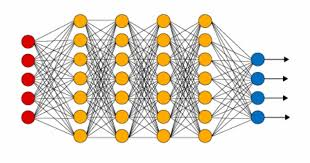

## BitTensor Network Daemon


> Decentralized Machine Intelligence

## Table of Contents

- [Overview](#overview)
- [To-Run-Locally](#to-run-locally)
- [To-Run-Remotely](#to-run-remotely)
- [Motivation](#motivation)
- [Organization](#organization)
  - [Nucleus](#nucleus)
  - [Dendrite](#dendrite)
  - [Synapse](#synapse)
  - [Metagraph](#metagraph)
- [Incentive](#incentive)
- [Word-Embeddings](#word-embeddings)
- [License](#license)

---

## Overview

BitTensor is a new class of Machine Learning model which is trained across a p2p network, it enables any computer and any engineer in the world to contribute.

The nature of trust-less computing necessitates that these contributions are combined through incentive rather than direct control from any one computer. We use a digital token to carry that incentive signal through the network: where the magnitude of this incentive is derived from a p2p collaborative filtering technique similar to Google's Page rank algorithm.  

The lack of centrality allows the structure to grow to arbitrary size across the internet. Both the cost and control of the system is distributed. And the network's informational product is efficiently priced into the reward token's value.

When run, this software folds your computing power into that p2p network and rewards you with an EOS based digital token for your contribution.

## To-Run-Locally
1. [Install Docker](https://docs.docker.com/install/)

```
$ git clone https://github.com/unconst/BitTensor
$ cd BitTensor

# Run EOS blockchain.
$ ./start_eos.sh

# Run Node 1.
# ./bittensor.sh

# Run Node 2.
# ./bittensor.sh

...

# Run Node N.
# ./bittensor.sh

```

## To-Run-Remotely (TODO)
1. [Install Docker](https://docs.docker.com/install/)
1. [Make account on Digital Ocean](https://www.digitalocean.com/)
1. [Make a Digital Ocean API key](https://cloud.digitalocean.com/account/api/tokens)

```
$ git clone https://github.com/unconst/BitTensor
$ cd BitTensor
$ export DIGITAL_OCEAN_TOKEN=YOUR_TOKEN_FROM_STEP_3

# Run EOS blockchain.
$ ./start_eos.sh --remote --token $DIGITAL_OCEAN_TOKEN
... EOS URL DISPLAYED HERE ...

# Run Node 1.
# ./bittensor.sh --remote --token $DIGITAL_OCEAN_TOKEN --eosurl <URL FROM ABOVE>

# Run Node 2.
# ./bittensor.sh --remote --token $DIGITAL_OCEAN_TOKEN --eosurl <URL FROM ABOVE>

...

# Run Node N.
# ./bittensor.sh --remote --token $DIGITAL_OCEAN_TOKEN --eosurl <URL FROM ABOVE>

```


## Motivation


"It is commonly argued that recent progress in machine learning has been largely driven by a drastic increase in the complexity and flexibility of the models used, both in terms of number of learnable parameters and the number of floating-point operations done by the model (e.g. [19]). This empirical observation that increasing model size is generally rewarded by improved performance leads us to look for ways to scale training to even larger models than those currently in use today." -- Aidan Gomez (ARC Nets NIPS: 2019)

Scale is nonetheless limited by our training mechanism. Back-propagation attempts to optimize the loss with respect to the entirety of the model's weights at each step, but this suffers from the ‘gradient locking problem’: where deep model parameters must wait for downstream parameters before moving on to its next update step. This is prohibitive when the scale of depth of those networks reach the scale desired by modern machine learning needs -- or biological scale.

Training networks composed of many 'local' loss functions allow us to train smaller subsections of the network independently, dividing and conquering the problem so that each locality is not dependent on far off events in the large network, hence eliminating this issue. This is not dissimilar to the (decentralized) parallel structure of natural systems, and has been successfully applied to increase the scale of Neural Networks into the trillion parameter range. [Gomez 2019].

While we have relieved an *algorithmic barrier* with our move from global to local objectives, there is still a *computational barrier* to building Neural Networks at biological scale. Specifically, it is not clear whether any one group has the hardware capabilities to run such a system: with some mild assumptions, training a quadrillion parameter Neural Network, just once, would cost tens of millions of dollars [?]. And, it is not clear whether one set of individuals alone could maintain such a huge system, or morally, if a small group should be allowed that much power.

It is the proposition of this system, that a solution to these concerns is a move from many closed Machine Learning systems towards an single open and decentralized one. The network is distributed across the web and run by a collaboration of teams, or persons, around the globe: Any computer or any engineer can contribute to this system. We do not require any centralized overhead. The system grows and adapts to the market demand for the network product. And the ownership, cost, and revenues of the model are split amongst it's contributors. -- from global to local control to mirror move from global to local objective. 

Within this new computing paradigm, components are organized around an incentive protocol which uses assumptions about the self-interested nature of the individual components to keep the system aligned to a global objective.  Sister technologies include the Bitcoin protocol or Bittorrent, both of which run without executive overhead -- and at their zenith exceeded the scale of centralized computing systems by many magnitudes. 

These qualities appear to be a chacteristic of decentralized computing systems: they can be harnessed to bring considerable volumes of [computing power](https://digiconomist.net/bitcoin-energy-consumption) and a large and diverse number of [collaborators](https://en.wikipedia.org/wiki/BitTorrent) to bear on a problem domain. And this is promising for Machine Learning in particular, which requires large amounts of computing power and benefits from extending model [capacity](https://arxiv.org/abs/1701.06538), [diversity](https://arxiv.org/pdf/1611.05725.pdf), and [collaboration](https://en.wikipedia.org/wiki/Ensemble_learning).

We follow this mold, and use an incentive model organized around a token emission scheme and recommendation network. The token we use, BDNF, is biologically inspired by its neurotransmitter namesake, which acts in the human central nervous system to stimulate neuro-genesis and survival. We make the large leap to conclude 'The brain is a market, and BDNF is its currency.' -- using this analogy to form the inspirational guide through which the following system is designed.

## Organization


###### Nucleus
The main Tensorflow graph is defined and trained within the Nucleus object. As is, the class is training a self supervised word-embedding over a dummy corpus of sentences in text8.zip. The result is a mapping which takes word to a 128 dimension vector, representing that word while maintaining its semantic properties.

Although subject to future change, this problem serves as a good starting place because its generality and ubiquity within Artificial intelligence. In future versions of this code, this will be expanded to include sentence and paragraph embeddings, speech, image and video embeddings with the goal of training the network for general multitask.

###### Dendrite
During training the Nucleus interacts with the rest of the network through its Dendrite. The Dendrite maintains connections to upstream nodes making asynchronous calls using GRPC, and passing serialized Tensor protocol buffers along the wire.

During validation and inference the Dendrite is cut from the model and replaced by submodules which have been trained through distillation to approximate the incoming signals from the rest of the network.

###### Synapse
This inference graphs being produced in training are served by the Synapse object. The Synapse is responsible for upstream connections. It is responsible for rate limiting, and through this,  negotiating for higher attribution within the Metagraph.

Since the Synapse object is merely serving the inference graph, it is mostly detached from the Nucleus and Dendrite during training, only communicating with these objects by pulling the latest and best inference graph from the storage directory.

###### Metagraph
The Metagraph object acts as an interface between the EOS blockchain and the rest of the neuron. Through the Metagraph, this node can post updated attributions and call timed token emission (which releases newly mined tokens) The Metagraph object also serves as a de-facto DHT which removes the need for a gossip protocol used by many standard p2p applications Bitcoin and BitTorrent not withstanding.

###### EOS
The EOS contract is separate from Dendrite. Nucleus, Synapse and Metagraph objects during execution. During testing, this class is run on a local EOS instance, but during production the contract is running in a decentralized manner across the EOS network.  

```
                 [EOS]
                   |
              [Metagraph]
           /       |       \
[Dendrite] ---> [Nucleus] ---> [Synapse]
           \       |       /
                 [Main]
```


## Incentive     


The BitTensor network, in aggregate, forms a single meta Machine Learning model composed of a many smaller interconnected sub-graphs. The connections between these nodes reflect channels along which tensors are passed, containing, in the forward direction, features, and in the reverse direction gradients: No different than the individual layers of a standard Neural Network architecture (or Tensorflow graph)



Client nodes communicate upstream to servers and, while training their local objective function, produce attribution values, which are numerical evaluations of each connection. We use Fishers Information Metric to produce attributions in the standard code, but any method is sufficient. In total, aggregated attributions from the entire network describe a directed weighted graph (DWG) structure. (Below)


The DWG is updated discretely through emission transactions, and are conglomerated on the EOS blockchain. This process produces global attribution scores: between the full-network and each sub-grph. New tokens are distributed in proportion to this global-attributuon.

Below is a simulated version of that emission written in numpy:

```
def bittensor_emission_simulation():

    # Stake vector.
    S = [1.  1.  1.  1.  1.  1.  1.  1.  1.  1.]

    # Loop-in edges.
    N = [0.6 0.9 0.4 0.5 0.5 0.5  1.  1.  1.  1. ]

    # Outgoing edges.
    M =[[0.  0.1 0.3 0.2 0.  0.  0.  0.  0.  0. ]
        [0.1 0.  0.  0.1 0.  0.  0.  0.  0.  0. ]
        [0.1 0.  0.  0.2 0.  0.  0.  0.  0.  0. ]
        [0.2 0.  0.3 0.  0.  0.  0.  0.  0.  0. ]
        [0.  0.  0.  0.  0.  0.5 0.  0.  0.  0. ]
        [0.  0.  0.  0.  0.5 0.  0.  0.  0.  0. ]
        [0.  0.  0.  0.  0.  0.  0.  0.  0.  0. ]
        [0.  0.  0.  0.  0.  0.  0.  0.  0.  0. ]
        [0.  0.  0.  0.  0.  0.  0.  0.  0.  0. ]
        [0.  0.  0.  0.  0.  0.  0.  0.  0.  0. ]]

    # Loop over blocks.
    n_blocks = 100
    for _ in range(n_blocks):        

        # Attribution calculation.
        depth = 100
        A = np.multiply(S, N)
        T = np.matmul(M, S)
        for _ in range(depth):
            A += np.multiply(T, N)
            T = np.matmul(M, T)

        # Emission calculation.
        tokens_per_block = 50
        A = A / np.linalg.norm(A, 1)
        E = A * tokens_per_block
        S = S + E
```


---

## Word-Embeddings

A word-embedding is a projection from a word to a continuous vector space representation of that word, which attempts to maintain the semantics under the projection, For instance, 'King' --> [0,1, 0,9, ..., -1.2], such that 'King' - 'Queen' = 'Male'.

Word-embeddings are highly useful initital projections for a large number of Machine Learning problems. This makes them an ideal product for our network. They can also be trained in an un-supervised fashion which is a requirment for the local-loss approach described above.

During training we use a language corpus and find our projection by training a classifier to predict words in context. For example, the sentence 'The queen had long hair', may produce a number of supervised training examples ('queen' -> 'had'), or ('hair' -> 'long'). The ability to predict context requires an understanding of the relationships between words ('meaning' is a relational quality) -- a highly successful assumption in practice.

In the prototype node above, we train each NN using a standard skip gram model, to predict the following word from the previous, however any other embedding producing method is possible -- indeed, the goal should be diversity.

## License

MIT
